# MCM Monitoring usecase - Wealthcare UI responding slow

This document explains about how  SRE  is going to analyze, and resolve an Incident, using MCM monitoring. 

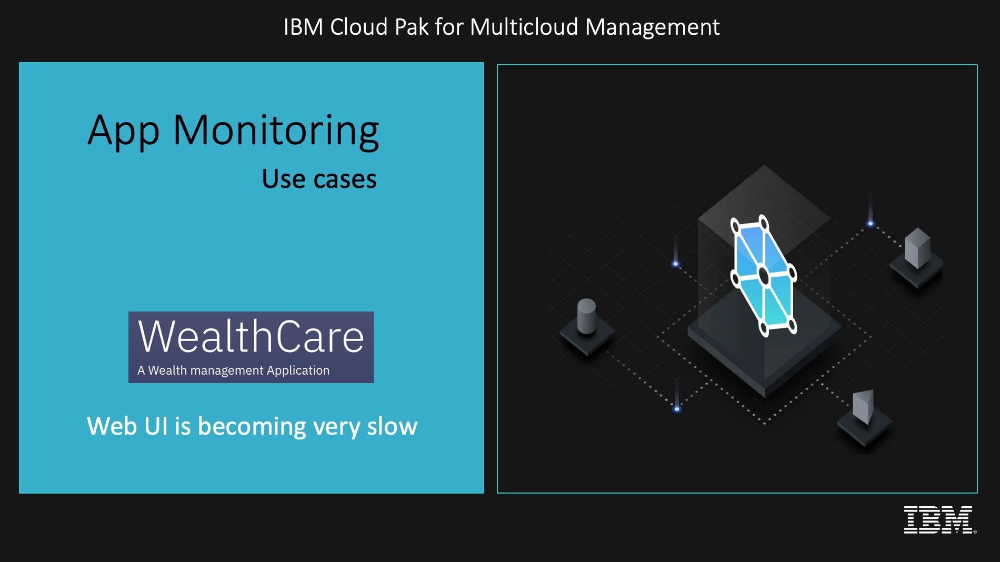

## Usecase

The Web user interface of the `Wealthcare application is becoming very slow`.

An incident about, Wealthcare UI responding slow, is created in the Multi-cloud Management Monitoring.

Now SRE is going to analyze and resolve the incident, by using the events, generated from Golden Signals of the Application Runtime.

Here is the usecase and incident handling flow.

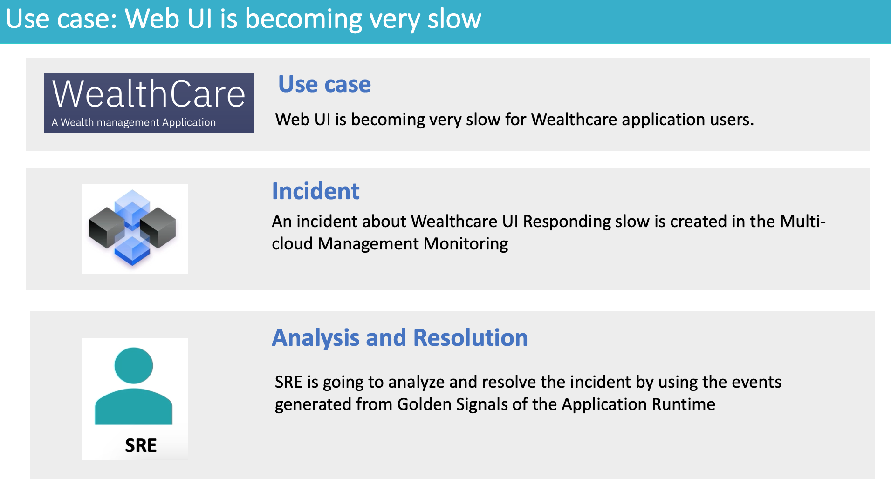

## Note

This usecase is going to leverages the following objects for Application Monitoring and Incident management.
- Thresholds
- Synthetic Tests
- Runbooks
- Event Policies
- Incident Policies

How to create and configure them is discused in another git repo. 

https://github.com/GandhiCloudLab/mcm-monitoring-usecase-responsetime-configuration

## Abstract of the Incident and resolution steps

Here is the abstract of the Incident and resolution steps.

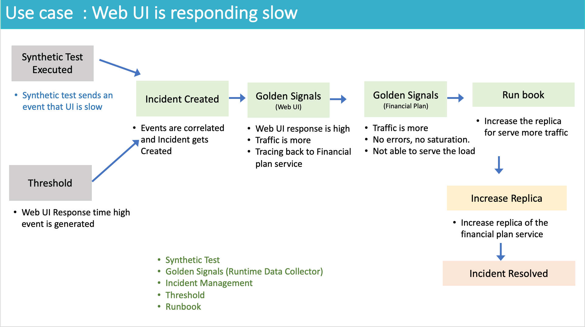

Synthetic test creates an event.

Threshold config will also create an event.

Both the events are correlated and incident get created.

SRE look at the events in the incident.

He opens the Golden signals page of the web UI service.

With the help of transaction tracing, he figure out that, the issue is with financial plan service.

Then he opens the Golden signals page of the financial plan service.

He identify the problem is because of traffic increase. 

He opens the runbook, and get to know that, he has to increase the, replica of the POD.

He did so.

The incident is resolved. 

## Incident list

As a SRE, I  login into MCM Monitoring console, and look at my group, for incidents. 

There is an incident about, Wealthcare UI, responding slow

Two  events  are  associated with this incident.
It is in, Assigned state.
It is assigned, to wealthcare group.
Lets click on Investigate, to do the analysis.
It opens up the incident detail.

## Incident Detail

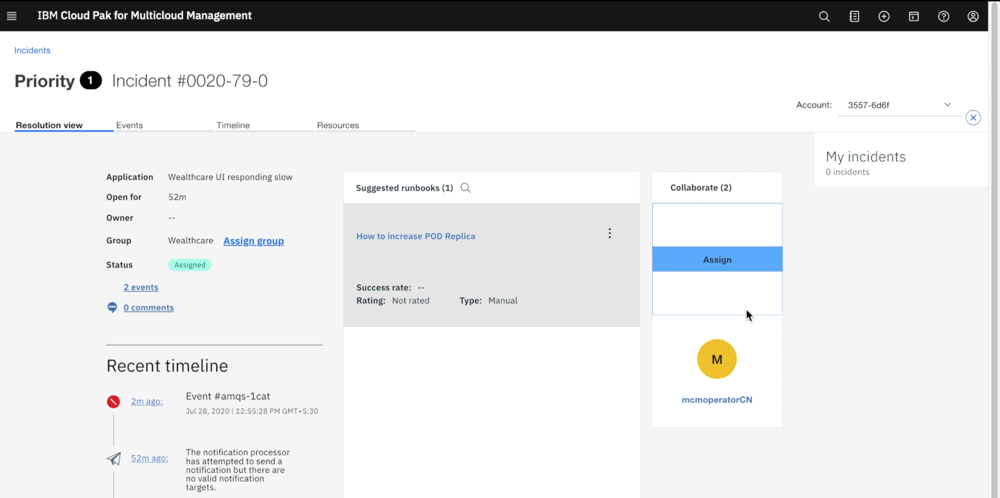

Two events are listed here.
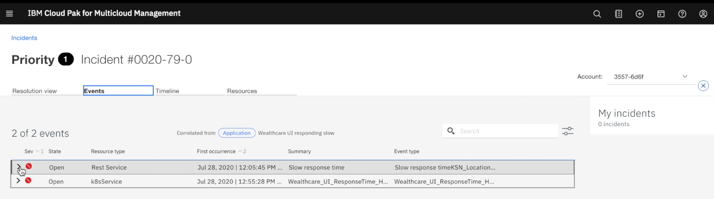

Event details of Synthetic test

Event details about the wealthcare response time is high.

So this event is about the wealthcare response time is high.

Lets goto the resource dashboard screen to understand the event in detail.

## Golden Signals of Web UI

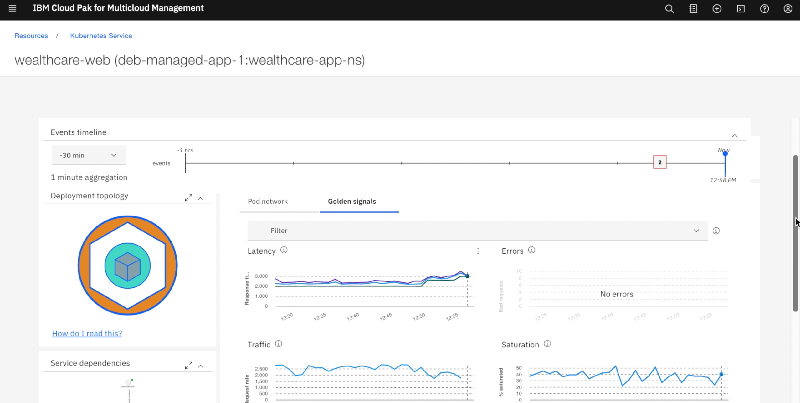

Here is the golden signals page, which shows Latency, Error, Traffic and Saturation. 

The Latency means the Response time, Error means, any error occurred during the execution of the service, Traffic is the request count, and Saturation is the memory usage. 

The latency and Error are the symptoms of the problem. 

The traffic and Saturation would be the cause of the problem.

As a SRE, lets see how to analyze the problem. 

We can observe that latency is showing higher value.

The traffic is also more. 

But there is no error and there is no problem with Saturation. 

Now we need to see, whether the problem is because of the dependent services. 

## Transaction tracing in Web UI
Click on the Transaction tracing icon of the API call.  

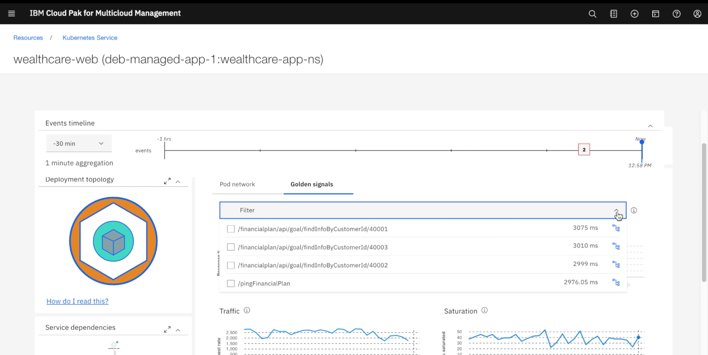

It goes to the tracing page. 

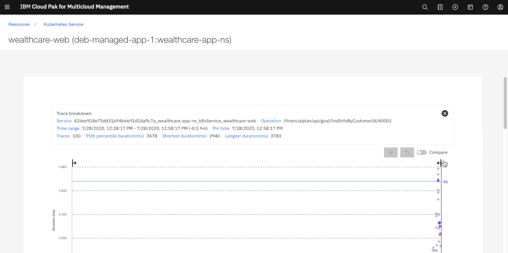

Choose any one of the transaction. 

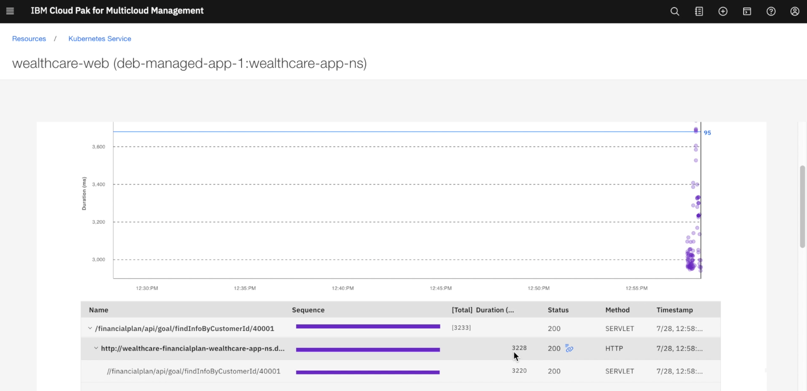

It shows the tracing of the selected transaction.

You can see that UI service is calling financial plan service.

You can observe that delay is from the financial plan service. 

So lets goto the financial plan service by clicking it form service dependencies.

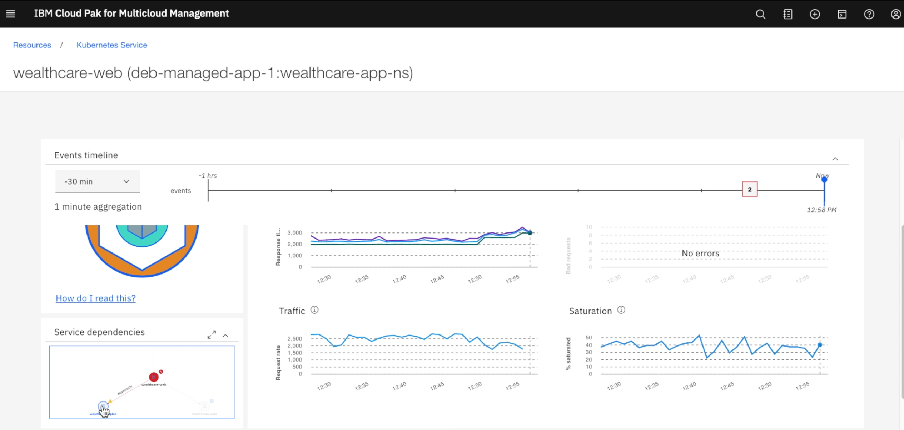

## Golden Signals of Financial plan

This page shows the golden signals of the financial plan service. 

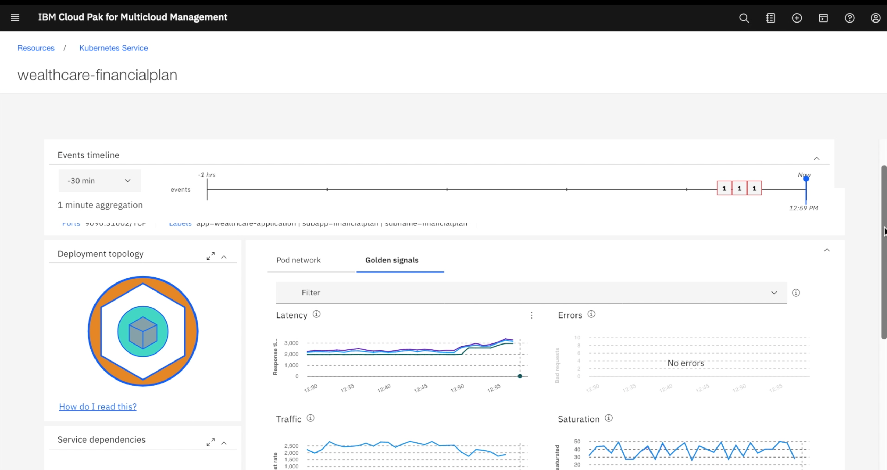

Here also the saturation and errors are normal.

But the response time is high and traffic is also more.

It looks like the traffic is increased, financial plan service is finding difficult to respond.

Now I need to see, how do I resolve this problem. 

Let me check is there any Runbook associated with this incident. 

## Resolve using Runbook

I go to the incident page again, and look for the runbook.

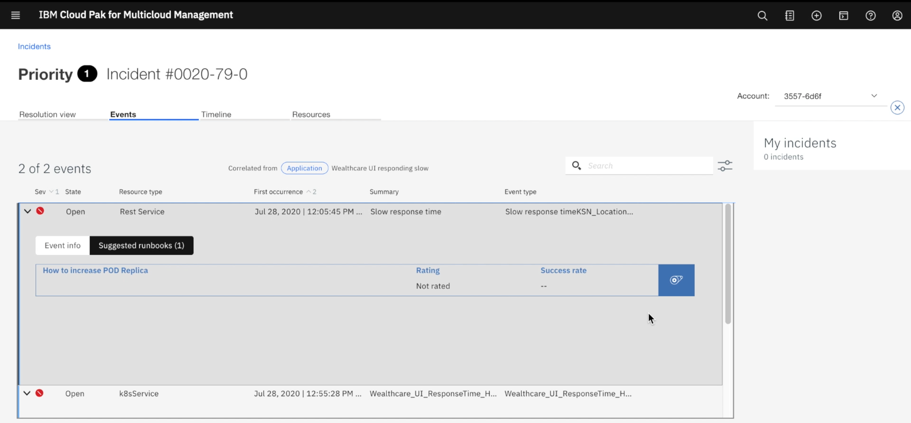

Runbook, contains the sequence of steps to solve the problem. Either it can be manual or automated. So Let me choose the runbook associated to the event.

Assign the incident to me. 

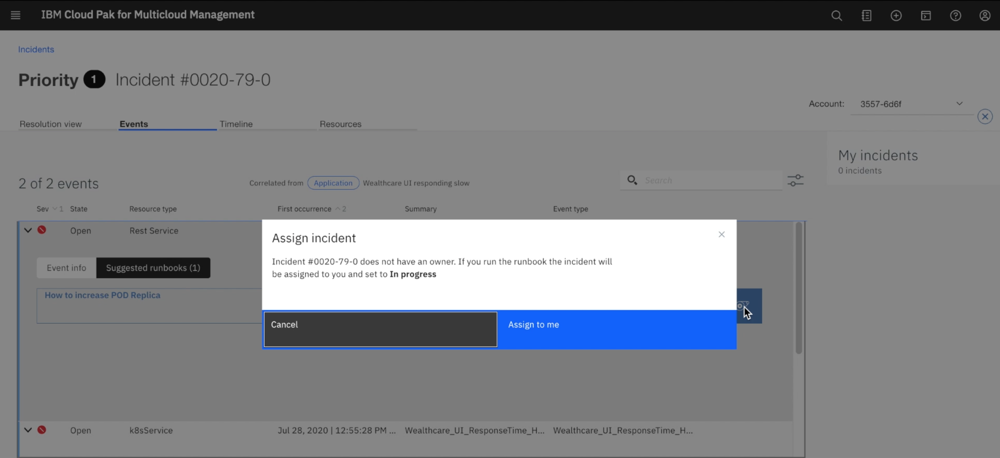

The step 1, of the runbook requests, to go to search screen in MCM console.
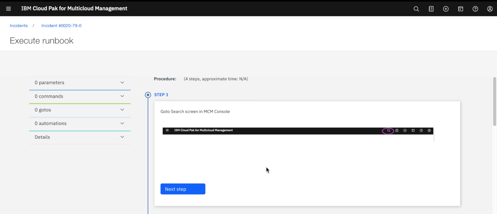

The step 2, requests to enter search text as given.
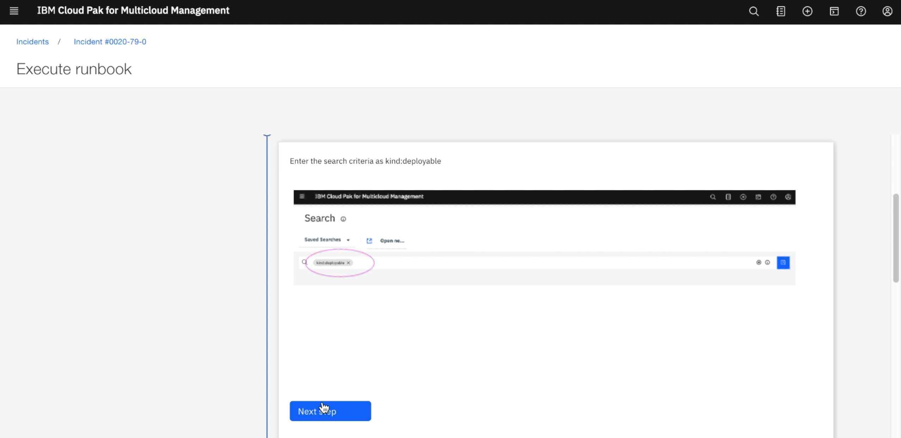

The step 3, requests to choose the deployable object for financial page.
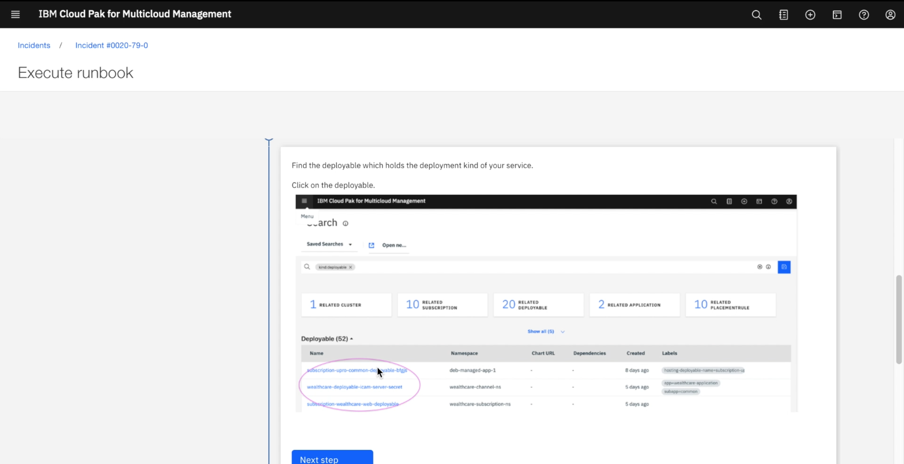

The step 4, requests to edit the yaml, and make the replica as 2.
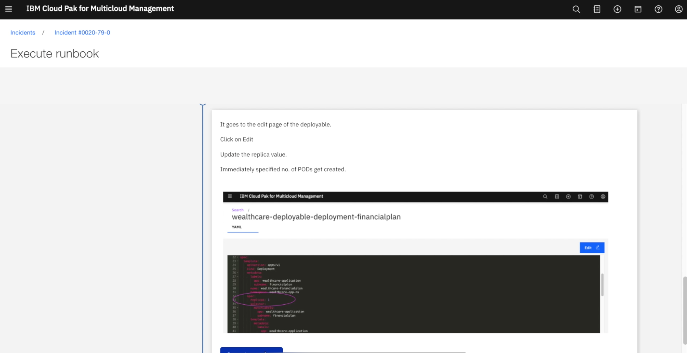

After the pod count increase, the performance of the financial plan service improved, and user did not feel the slowness.

Now I resolve this incident.

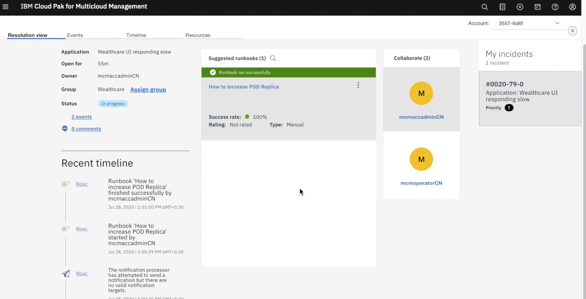

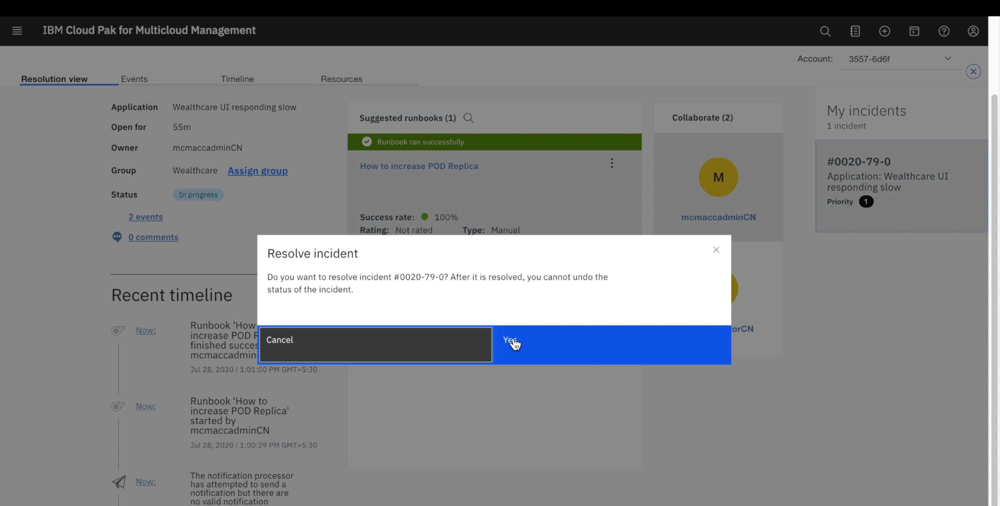

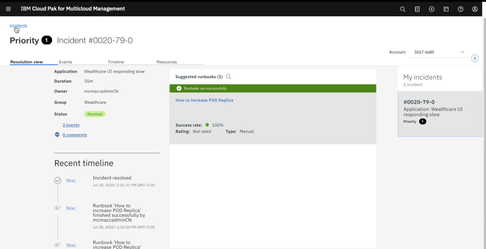
