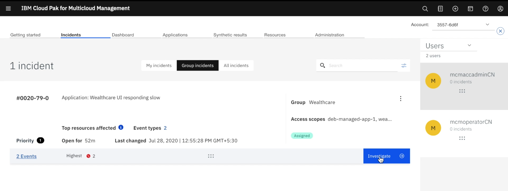
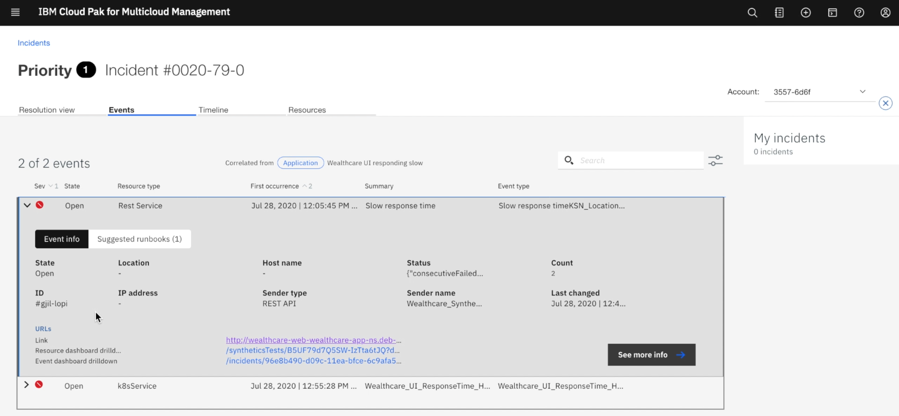

# MCM Monitoring use case - Wealthcare UI responding slow

This document explains about how  SRE  is going to analyze and resolve an Incident using MCM monitoring. 

## Use case

The Web user interface of the `Wealthcare application is becoming very slow`.

An incident about `Wealthcare UI responding slow` is created in the Multi-cloud Management Monitoring.

Now SRE is going to analyze and resolve the incident by using the events generated from Golden Signals of the Application Runtime.

Here is the use case.

## Note

This use case is going to leverages the following objects for Application Monitoring and Incident management.
- Thresholds
- Synthetic Tests
- Runbooks
- Event Policies
- Incident Policies

How to create and configure them are discussed in another git repo. 

https://github.com/GandhiCloudLab/mcm-monitoring-usecase-responsetime-configuration

------

## Abstract of the Incident and resolution steps

Here is the abstract of the Incident and resolution steps.

Synthetic test creates an event.

Threshold config will also create an event.

Both the events are correlated and incident get created.

SRE look at the events in the incident.

He opens the Golden signals page of the web UI service.

With the help of transaction tracing, he figure out that, the issue is with financial plan service.

Then he opens the Golden signals page of the financial plan service and he identify the problem is because of traffic increase.

He opens the runbook and get to know that he has to increase the replica of the POD. He did so.

The incident is resolved. 

------

## Incident list

As a SRE, I  login into MCM Monitoring console and look at my group for incidents. 

There is an incident about Wealthcare UI responding slow

Two events are associated with this incident.

It is in Assigned state.

It is assigned to wealthcare group.

Lets click on Investigate to do the analysis.

It opens up the incident detail.

## Incident Detail

Two events are listed here.

Here is the event details of `Synthetic test`.

Here is the event details of `Wealthcare response time is high`.

Lets goto the resource dashboard screen to understand the event in detail.

## Golden Signals of Web UI

Here is the golden signals page of the `Web UI` service. 

The Golden signal shows
- Latency
- Error
- Traffic
- Saturation

We can observe the following from the graph.
- Latency is `high`
- Traffic is `high`
- No Errors
- Saturation is `normal` 

Now we need to see, whether this `Latency` is because of the dependent services. 

## Transaction tracing in Web UI
Click on the Transaction tracing icon of the API call.  

It goes to the tracing page. 

Choose any one of the transaction. 

It shows the tracing of the selected transaction.

You can see that UI service is calling financial plan service.

You can observe that delay is from the financial plan service. 

So lets goto the financial plan service by clicking it from `service dependencies`.

## Golden Signals of Financial plan

This page shows the golden signals of the financial plan service. 

We can observe the following from the graph.
- Latency is `high`
- Traffic is `high`
- No Errors
- Saturation is `normal` 

It looks like the traffic is increased so the financial plan service is finding difficult to respond.

Now I need to see, how do I resolve this problem. 

Let me check is there any Runbook associated with this incident. 

## Resolve using Runbook

I go to the incident page again and look for the runbook.

Runbook, contains the sequence of steps to solve the problem. Either it can be manual or automated. 

There is an run book assoicated this event. Let me choose the runbook.

I need to assign the incident to me. 

The step 1 of the runbook requests to go to `search` screen in MCM console.

The step 2 requests to enter search text as given.

The step 3 requests to choose the deployable object for financial page.

The step 4 requests to edit the yaml and make the replica as 2.

After the pod count increase, the performance of the financial plan service is improved and user did not feel the slowness.

Now I resolve this incident.

